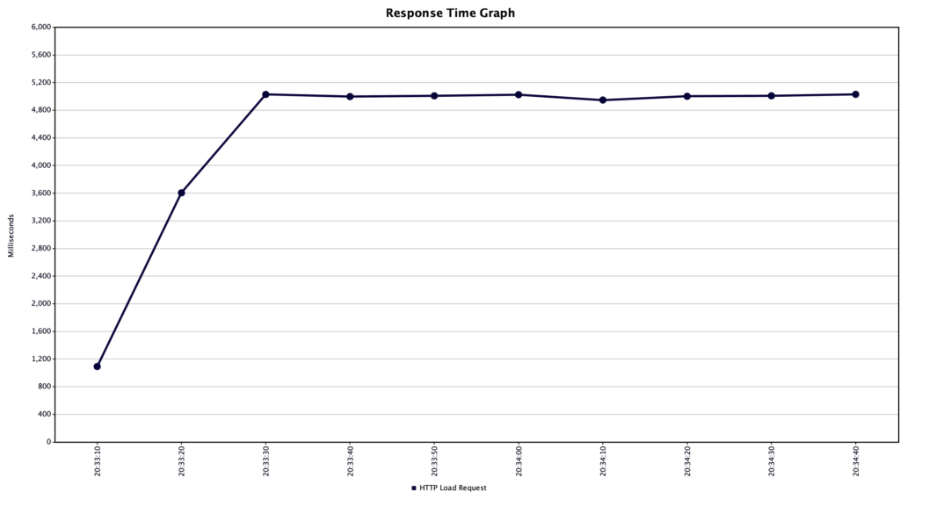
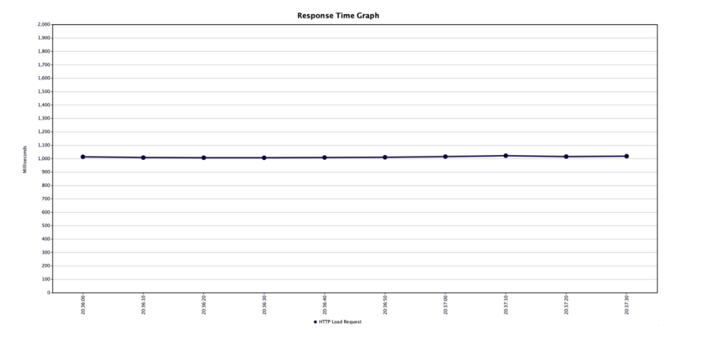

# Spring JDK 21 Virtual thread 설정 샘플

- Spring boot 3.2
- JDK 21

JDK21이 Release되어 가상 쓰레드가 정식으로 제공되었다.   
가상 스레드로 간단히 전환해보고, 일반 쓰레드와 성능차이를 테스트한다.   

### 가상 쓰레드 설정

처음에는, 별도로 설정이 필요하고 러닝커브가 있는 기술이라고 생각했는데, 간단한 설정이면 기존 쓰레드가 대체되어 편의성이 아주 좋다.   

```java
// spring.thread-executor = virtual 일 때, 동작시키도록 설정
@EnableAsync
@Configuration
@ConditionalOnProperty(
        value = "spring.thread-executor",
        havingValue = "virtual"
)
public class VirtualThreadConfig {
    @Bean
    public AsyncTaskExecutor applicationTaskExecutor() {
        return new TaskExecutorAdapter(Executors.newVirtualThreadPerTaskExecutor());
    }

    @Bean
    public TomcatProtocolHandlerCustomizer<?> protocolHandlerVirtualThreadExecutorCustomizer() {
        return protocolHandler -> protocolHandler.setExecutor(Executors.newVirtualThreadPerTaskExecutor());
    }
}
```

**조건부 활성 사용 시**
```yaml
spring.thread-executor: virtual # none
```

`@ConditionalOnProperty`에 의해, 가상쓰레드 활성 설정이 ON/OFF 된다.   

#### 호출 테스트

```bash
curl -XGET localhost:8080/test/thread

> Thread[#71,http-nio-8080-exec-1,5,main] # 일반 쓰레드 설정시의 응답
> VirtualThread[#87]/runnable@ForkJoinPool-1-worker-1 # 가상 쓰레드 설정시의 응답
```

#### 부하 테스트

위에서 만든 샘플 기능에 `Thread.sleep(1000)`을 추가한 후, Ngrinder 또는 JMeter 등으로 테스트해보자.   

*일반 쓰레드의 경우*



*경량 쓰레드의 경우*



#### 결과 

일반 쓰레드의 경우 일정량의 쓰레드 갯수 이후 Context switching 비용으로 인해 점점 느려지는 반면, 경량 쓰레드의 경우 1초로 잘 유지되고 있는 것을 확인할 수 있었다.   
물론 모든 환경에 경량 쓰레드가 잘 될지는 Production 환경에서 테스트해봐야 할 것 같지만 Reactive 기반의 코드 스타일로 전환하는 비용보다는 간단하게 성능적 이점을 챙길 수 있을 거라고 본다.   
추후 하는 모든 Spring java 프로젝트는 JDK21 기반의 Virtual Thread 환경에서 진행해볼 예정이다. 